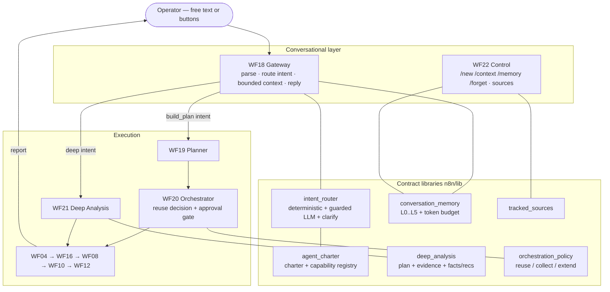

# Conversational Marketing Scout Agent

The Telegram bot is a **real conversational agent**, not a button menu. Free-form natural language is the
primary interface; buttons are optional accelerators whose callbacks map to the same intents you could type.
The agent resolves contextual references ("the first two", "them", "the previous report"), remembers what
matters within a bounded budget, and runs a controlled deep-competitor-analysis mode — without ever sending the
whole transcript to Claude or claiming a capability it can't run.

Built on the Stage 4 foundation (DEC-150); conversational layer is DEC-151 (intent + memory) and DEC-152
(deep analysis + reuse).

---

## Architecture



## Conversation flow

```mermaid
sequenceDiagram
    actor Op as Operator
    participant GW as WF18 Gateway
    participant EX as WF19/WF20/WF21
    Op->>GW: "Найди конкурентов по ПТС в Москве"
    GW->>GW: route (deterministic) → competitor_search; build bounded context
    GW-->>Op: plan + "нужно подтверждение" (text; ✅/✖ optional)
    Op->>GW: ✅ / "запускай"
    GW->>EX: approved → collect → report
    EX-->>Op: factual report + NL invitation
    Op->>GW: "сравни первых двух подробнее"
    GW->>EX: deep_competitor_analysis (competitors resolved from last report)
    EX-->>Op: deep report — FACTS (with evidence) vs RECOMMENDATIONS
    Op->>GW: "добавь их сайты в мониторинг"
    GW->>GW: resolve competitor URLs from context → add once (idempotent)
    Op->>GW: "какие идеи можно адаптировать?"
    GW->>EX: reuse last report — ZERO new paid calls
    EX-->>Op: ideas (clearly marked recommendations)
```

## Intent schema & supported intents

The guarded Claude classifier (used only for ambiguous free text) must return strict JSON:

```json
{
  "intent": "deep_competitor_analysis",
  "confidence": 0.92,
  "entities": { "competitor_refs": ["first_two"], "region": null, "service": null,
                "platforms": ["website", "telegram_channel", "vk_community"] },
  "requires_context": true,
  "requires_approval": true,
  "requested_action": "build_plan"
}
```

Invalid/unsupported output ⇒ one clarification question (never a runnable intent). Supported intents:
`competitor_search`, `deep_competitor_analysis`, `clarify_request`, `report_followup`, `generate_ideas`,
`add_source`, `manage_sources`, `compare_periods`, `rerun_request`, `status`, `cancel`, `help`, `manage_memory`.
Only these (registry) IDs are routable — Claude cannot invent a capability or callback.

## Memory architecture & compaction

| Layer | What | Where |
|------|------|-------|
| L0 | immutable versioned charter | `agent_charter.charterText()` |
| L1 | current request state | `conversation_state` tab |
| L2 | recent message window (default 8) | `conversation_messages` (NOT reloaded in full) |
| L3 | versioned rolling summary (preserves IDs/decisions verbatim; prev retained) | `conversation_summaries` |
| L4 | durable per-user memory (forget/forget-all audited) | `durable_memories`, `memory_audit_events` |
| L5 | relevant artifacts (plan/report/competitors/sources) | retrieved on demand, not whole tabs |

**Token budget** (`buildContext`): sections assembled in priority order — charter → current state →
approval/safety → newest user message → artifacts → recent → summary → durable — under
`MS_MAX_CONTEXT_TOKENS`. Charter, current state, safety constraints and the newest user message are **never
dropped**; omitted sections + truncation are recorded in `context_usage`.

## Memory control commands

`/new` (reset context, keep preferences) · `/context` (show interpreted context) · `/memory` (list durable
memory) · `/forget <item>` (remove one) · `/forget_all` (confirmation-gated). Free-text equivalents work too
("забудь предыдущего конкурента", "начни заново, но запомни Москву", "не запоминай этот запрос"). Memory is
isolated per Telegram user; deletions are audited with a value **hash**, never the raw value; a no-memory mode
is supported per request.

## Deep competitor analysis

`deep_competitor_analysis` builds an explicit, approval-gated plan that degrades gracefully across **only
configured** sources: `website_only → website_history → website_telegram → website_vk → full`. Telegram/VK are
included only when allow-listed **and** backed by an active tracked source; otherwise they are listed in
`unavailable_sources` with a reason — the agent never claims access it lacks. Page count, external calls and
budgets are clamped.

**Evidence vs recommendation.** Every factual conclusion (a *finding*) carries source URL/record + `source_run_id`
+ excerpt + timestamp + quality + confidence; a finding without that anchor is rejected and can never present as
a fact. *Recommendations* are typed separately and must reference the findings they derive from; an unsupported
recommendation is held back. Findings → `deep_analysis_findings`; recommendations → `deep_analysis_recommendations`.

## Source-availability behavior (website / Telegram / VK)

Website is first-class. Telegram/VK are available only when the platform is in `MS_SOURCE_ALLOWLIST` and a
tracked source exists; otherwise the agent reports the source as unavailable with a reason. Adding a source for
an unconfigured platform is honestly refused.

## Conversation-aware orchestration (no wasted paid calls)

Before any external call, `orchestration_policy.reuseDecision` chooses **reuse / collect / extend**:
"explain the second" and "generate ideas" reuse the last report (`needs_external_call=false`); "compare with
last time" reuses stored snapshots; "refresh"/"run again" collect; a newly-requested **configured** platform
extends. Every decision + reason is persisted to `orchestration_decisions`.

## Tests

```bash
node tests/test_agent_contracts.js          # charter/router/memory/response/sources  (109)
node tests/test_agent_workflows.js          # WF18/WF22 drift + offline execution      (30)
node tests/test_deep_analysis_contracts.js  # deep plan + evidence + reuse policy       (43)
node tests/test_deep_analysis_workflows.js  # WF21 + WF20 reuse drift + execution        (22)
node tests/test_agent_e2e.js                # full multi-turn conversational E2E         (30)
make test                                   # everything, offline, $0, 0 external calls
```

## Known limitations

- Single operator (allow-listed), website-first; Telegram/VK adapters are optional and gated by configuration.
- The guarded Claude intent classifier and planner/summary are **off by default**; with them off the agent is
  fully deterministic. Deterministic keyword routing covers the common phrasings, not every possible utterance.
- Costs are reported, not metered live (`unknown` unless a connector reports); budgets are pre-call ceilings.
- Deep-analysis collection beyond the website still depends on the underlying source adapters being configured;
  search-card → confirmed-offer enrichment remains a documented gap.
- No production-scale claims — validated by an offline harness + mocked multi-turn replay, not load-tested.
