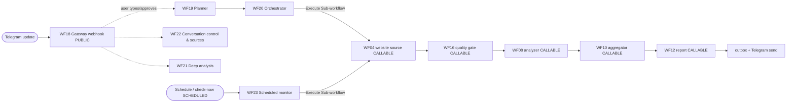

# n8n Compatibility, Topology & Capability Map

Release-hardening audit for the Marketing Scout Telegram agent. Everything here is verified statically by
`tools/audit_workflows.js` (run `node tools/audit_workflows.js`) and asserted by `tests/test_release_audit.js`.
No local n8n CLI is required for the audit; a disposable-import smoke test is provided for when n8n is present.

## 1. n8n CLI / version detected

At hardening time **no local n8n CLI was installed** (`command -v n8n` → not found). The audit therefore uses a
static resolver (node types, workflow references, trigger contracts) and the operator runs the disposable
import smoke test below in their own n8n environment. **No production n8n database or folder was touched.**

## 2. Workflow dependency graph (Telegram path)



Resolved Execute Sub-workflow edges (all point to real repository workflows — **0 unresolved references**). Each
edge now passes **named canonical fields** (not positional/`.first()` input) to the callable's declared trigger:

| caller | targets | named inputs passed |
|--------|---------|---------------------|
| WF20 Orchestrator | WF04, WF16, WF08, WF10, WF12 | `agent_request_id`, `source_run_id`, `data_mode` (+`urls`/`platform_filter`) |
| WF21 Deep Analysis | WF04 | `agent_request_id`, `source_run_id`, `data_mode` |
| WF23 Scheduled Monitor | WF04 (+ WF16 quality) | `source_run_id` (idempotency key), `urls` (the tracked source ref), `data_mode` |

**Placeholder workflow IDs (7):** every Execute Sub-workflow node carries `workflowId.value = PASTE_WORKFLOW_ID`.
This is intentional — n8n assigns IDs on import, so the operator binds each sub-workflow ID **after import** (the
audit catalogs these as post-import bindings, not breakage).

**Workflow classification** (`tools/audit_workflows.js` → `classification`):

| class | workflows |
|-------|-----------|
| public (webhook) | WF18 — **only** public entrypoint |
| scheduled | WF23 (`scheduleTrigger` + manual "check now") |
| callable + manual-diagnostic | WF04, WF08, WF10, WF12, WF16 |
| manual-only entrypoints | WF17, WF19, WF20, WF21, WF22 (+ Stage 1–3 diagnostics) |

### Resolved — callable sub-workflows now carry an Execute Sub-workflow Trigger

The callable targets **WF04, WF08, WF10, WF12, WF16** each now contain an **Execute Sub-workflow Trigger**
(`n8n-nodes-base.executeWorkflowTrigger`, node name *When Called by Agent*) wired into the same config node the
manual trigger feeds. The existing **Manual Trigger is preserved** for standalone diagnosis. Each trigger declares
an explicit input contract; the config node merges those canonical inputs over its defaults, and — because manual
runs deliver an empty input item — manual-mode behavior is **byte-for-byte unchanged** (proven by the unchanged
Stage 1–3 suites and by `tests/test_release_audit.js`). The release audit now treats a callable **without** a
Sub-workflow Trigger, or a callable exposed via a **public webhook**, as a **hard error** (the audit fails).

**Declared callable input contracts** (canonical fields per target):

| callable | declared trigger fields |
|----------|-------------------------|
| WF04 | `agent_request_id`, `source_run_id`, `workflow_run_id`, `data_mode`, `urls`, `force_reprocess` |
| WF08 | `agent_request_id`, `source_run_id`, `workflow_run_id`, `data_mode`, `force_reprocess`, `platform_filter`, `source_type_filter`, `llm_enabled`, `llm_approval_token`, `llm_budget_usd`, `request_cancelled`, `max_records` |
| WF10 | `agent_request_id`, `source_run_id`, `workflow_run_id`, `data_mode`, `platform_filter`, `region_filter`, `service_type_filter`, `report_eligible_filter`, `quality_status_filter`, `review_status_filter`, `time_window_days`, `niche_id` |
| WF12 | `agent_request_id`, `source_run_id`, `workflow_run_id`, `data_mode`, `report_type`, `niche_id`, `region`, `top_n`, `enable_llm_summary`, `llm_approval_token` |
| WF16 | `agent_request_id`, `source_run_id`, `workflow_run_id`, `data_mode`, `platform_filter`, `source_family_filter`, `freshness_window_days`, `fixture_self_test` |

Mapping into each callable preserves lineage/approval/quality/idempotency/budget semantics: e.g. `source_run_id`
→ `source_run_id_filter` (run isolation), `agent_request_id` → `agent_request_id_filter`, `data_mode` flips
WF16's `fixture_self_test` off for live runs. No business logic was rewritten.

## 3. Actual platform capability map

| platform | collector | what it really does | canonical ref | history? | credentials | default state |
|----------|-----------|---------------------|---------------|----------|-------------|---------------|
| **website** | WF04 (Firecrawl) | scrape pages → `raw_market_records` → WF16/WF08 | root URL | snapshots stored | Firecrawl/Apify | **collectable** |
| **Telegram** | WF11 (`t.me/s/<channel>` public preview) | recent **public preview** posts only — **not** bot `channel_post`, **not** comments, **not** arbitrary history; approval-gated, fixture-first | `t.me/<channel>` / `@channel` | recent preview only | none for public preview (live fetch is gated) | **setup_required** unless `MS_ENABLE_TELEGRAM_COLLECTOR=true` |
| **VK** | WF13 (VK Public Discussion/Lead connector) | wall posts + comments + monitored-group engine exist as **fixture + disabled live placeholders**; no live fetch wired | `vk.com/<group>` | fixture only | VK API creds (absent) | **setup_required** |

Behaviour: a configured collector → the source may become `active`; a missing collector/credentials →
`setup_required`; an unavailable platform stays visible in `/help` with its reason; deep analysis includes
Telegram/VK **only** when real compatible data is available. The agent never claims Telegram/VK analysis it
cannot perform.

## 4. Persistence wiring (context survives a fresh n8n execution)

Verified by `tests/test_release_audit.js` — real Google Sheets nodes, correct tabs + operations:

| concern | workflow | operation | tab |
|---------|----------|-----------|-----|
| conversation messages | WF18 | read + append | `conversation_messages` |
| conversation state | WF18 | read + **appendOrUpdate** (match `conversation_id`) | `conversation_state` |
| rolling summaries | WF18 | append (when threshold crossed) | `conversation_summaries` |
| context usage | WF18 | append | `context_usage` |
| durable memories | WF22 | read (+ audit) | `durable_memories`, `memory_audit_events` |
| tracked sources | WF22 write / WF23 read+update | append / appendOrUpdate-style | `tracked_sources` |
| source change events | WF23 | read + append | `source_change_events` |
| telegram outbox | WF20 | append (before send) | `telegram_outbox` |
| execution summaries | WF20 | append | `execution_summaries` |

Because WF18 both **writes** and **reads** `conversation_state`/`conversation_messages`, a new n8n execution
reconstructs context from Sheets with no in-memory process state. Memory rows carry `owner_user_id` for
per-user isolation.

## 5. Activation / publication rules

- All repository workflow JSON stays `active=false`.
- Import everything inactive (`scripts/deploy_n8n.sh --apply`).
- Activate **only trigger workflows**, and only when explicitly requested:
  - **WF18 Telegram Gateway** — to accept live requests.
  - **WF23 Scheduled Monitor** — only when automatic monitoring is enabled.
- Callable sub-workflows (WF04/08/10/12/16, WF19/20/21/22) are imported but **not** exposed via public triggers.
  They are reachable only via Execute Sub-workflow (each now has an Execute Sub-workflow Trigger).
- `scripts/deploy_n8n.sh --activate-triggers` activates **only** WF18 (always) and WF23 (only when
  `MS_MONITORING_ENABLED=true`), after an explicit confirmation (or `--yes`). It detects the n8n version, uses
  `n8n update:workflow --id=<id> --active=true` (the OSS CLI has no separate "publish" step), never activates a
  callable, never overwrites credentials, and refuses to run if the n8n CLI is absent. It is operator-run and was
  **not** executed during hardening (no n8n CLI present here).

## 6. Disposable local import smoke test (operator-run)

When n8n is available, `scripts/n8n_import_smoke.sh` runs a fully disposable import: it creates a **temporary**
`N8N_USER_FOLDER` + temporary SQLite DB (never the production folder/db), imports all agent workflows, prints
the assigned IDs, confirms every workflow is inactive, and deletes the temp dir. Exact command:

```bash
scripts/n8n_import_smoke.sh           # uses a mktemp -d folder, auto-cleaned
# equivalent manual form:
export N8N_USER_FOLDER="$(mktemp -d)"
n8n import:workflow --separate --input=n8n/workflows   # into the throwaway sqlite under $N8N_USER_FOLDER
n8n list:workflow                                      # capture assigned IDs (all active=false)
rm -rf "$N8N_USER_FOLDER"
```

It never activates/publishes and never touches the production database.
