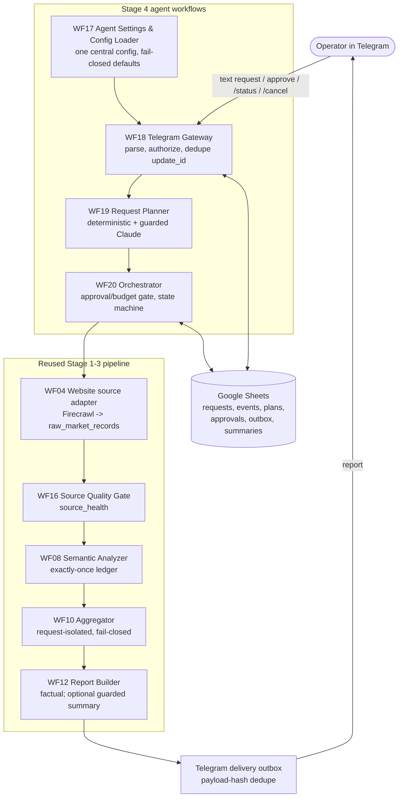
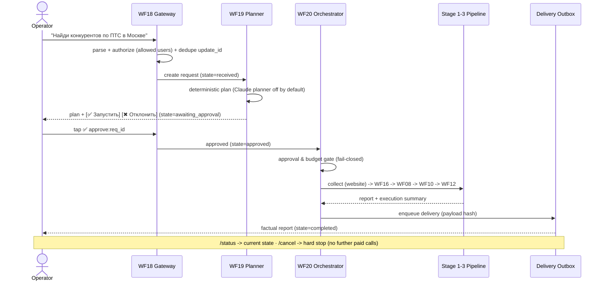

# Stage 4 — Single-User Telegram Marketing Agent

Stage 4 turns the Stage 1–3 workflows (collection → quality gate → analysis → aggregation → report) into one
**operator-facing agent**. A single user sends a plain-text request in Telegram; the agent plans the work,
asks for explicit approval, collects from allow-listed sources (website-first), runs the existing quality and
analysis pipeline, builds a factual report, and delivers it back to Telegram — with a durable state machine and
**one chokepoint** that every paid/external call must pass.

Scope is deliberately **single-user and website-first**. This is a portfolio-grade MVP, not a multi-tenant SaaS.
See [Known limitations](#known-limitations).

---

## Architecture



Every box that can spend money (Apify/Firecrawl collection, Claude planner, Claude summary) sits **behind** the
approval/budget gate in WF20 and is **off by default**. Production Claude/Apify nodes are not deleted — they are
guarded by executable runtime checks (approved + within budget + feature flag on + not already done).

---

## Telegram user flow



Supported inbound: free-text request, `approve:`/`reject:` callbacks, `/status`, `/cancel`. A duplicate
`update_id` (e.g. Telegram re-delivery) creates **one** request, not two.

---

## State machine

`received → classified → awaiting_approval → approved → collecting → quality_check → analyzing →
aggregating → reporting → delivering → completed`, with `partial`, `failed`, `cancelled` as terminal
outcomes. Transitions are validated (mandatory states cannot be skipped), every transition is persisted to
`agent_request_events`, terminal states are absorbing, and `canMakeExternalCall()` returns false once a request
is cancelled/finished — so a stale callback can never start new paid work.

## Approval, budget & idempotency

`n8n/lib/approval_gate.js` is the single gate. A source call proceeds **only** when: not cancelled/terminal,
approved (when required), source allow-listed, under the item/call ceilings, under the source and LLM budgets,
and the deterministic `idempotencyKey(request, source, attempt)` has not already completed. A repeated approval
callback or a re-fired branch therefore **cannot spend twice**. Costs that are genuinely unknown stay
`unknown` (the agent never fabricates `$0`).

---

## Central configuration

One object, resolved once by `n8n/lib/agent_config.js` from environment variables, consumed by every Stage 4
workflow. No Spreadsheet ID is hand-pasted into nodes; **no secrets** live in JSON (credentials stay in the n8n
credential store).

| env var | meaning | default (fail-closed) |
|---|---|---|
| `MS_SPREADSHEET_ID` | Google Sheet id (an id, not a secret) | — (required) |
| `MS_TELEGRAM_ALLOWED_USER_IDS` | comma list of allowed Telegram user ids | — (required) |
| `MS_SOURCE_ALLOWLIST` | allowed sources | `website` |
| `MS_MAX_ITEMS_PER_SOURCE` | item ceiling per source | `25` |
| `MS_MAX_EXTERNAL_CALLS` | cumulative external-call ceiling | `40` |
| `MS_SOURCE_BUDGET_USD` / `MS_LLM_BUDGET_USD` | budgets | `0.20` / `0.50` |
| `MS_REQUIRE_APPROVAL` | require human approval before any paid call | `true` |
| `MS_ENABLE_LLM_PLANNER` / `MS_ENABLE_LLM_SUMMARY` | enable Claude planner / summary | `false` / `false` |

Missing required vars set `config_complete=false`; the orchestrator surfaces that in the execution summary and
never starts paid work blind.

---

## Run the tests (offline, $0, no network)

```bash
make test
# or a focused Stage 4 run:
node tests/test_stage4_contracts.js    # 7 libraries, unit-level
node tests/test_stage4_workflows.js    # embedded-code drift proof + offline node execution
node tests/test_stage4_e2e.js          # mocked end-to-end replay (16 scenarios + full happy path)
```

All Claude/Apify/Firecrawl calls are gated and off by default; the regression performs **zero external calls**
and incurs **$0**.

## Deploy (inactive-by-default)

```bash
scripts/deploy_n8n.sh --check-config   # verify MS_SPREADSHEET_ID + MS_TELEGRAM_ALLOWED_USER_IDS
scripts/deploy_n8n.sh --dry-run        # validate JSON + print import plan (no changes)
scripts/deploy_n8n.sh --apply          # import into n8n; workflows stay active=false
```

Import order (enforced by the script): **WF17 → WF18 → WF19 → WF20**. The import preserves `"active": false`
and never touches credentials.

## One-time setup

1. Create the Google Sheets tabs from [`SHEETS_MIGRATION_STAGE_4.md`](SHEETS_MIGRATION_STAGE_4.md) (exact headers).
2. Set `MS_SPREADSHEET_ID` and `MS_TELEGRAM_ALLOWED_USER_IDS` (plus any optional budgets/flags) in the n8n env.
3. `scripts/deploy_n8n.sh --apply` to import WF17–WF20 (inactive).
4. In the n8n UI, attach credentials: Google Sheets, Telegram Bot, Claude (only if enabling LLM), Apify/Firecrawl.
5. Leave `MS_ENABLE_LLM_PLANNER` / `MS_ENABLE_LLM_SUMMARY` **off** until you intend to pay for Claude.
6. Activate **only** WF18 (Telegram Gateway) when ready to accept live requests.

## One controlled live end-to-end (operator-run, costs money)

> This is the **only** step that performs real external calls. Do it once, deliberately, with eyes on the budget.

1. Confirm `make test` is green and `scripts/deploy_n8n.sh --dry-run` shows all workflows `active=false`.
2. Set a **tiny** budget: `MS_MAX_EXTERNAL_CALLS=4`, `MS_SOURCE_BUDGET_USD=0.05`, `MS_LLM_BUDGET_USD=0`
   (summary off) for the first live run.
3. Activate WF18 only. From an **allowed** Telegram account send one request, e.g.
   *"Найди 1 конкурента по ПТС в Москве, посмотри сайт"*.
4. Verify the agent replies with a **plan + approve/reject buttons** and that nothing was collected yet
   (`agent_requests.state = awaiting_approval`, zero rows in `source_health` for this `agent_request_id`).
5. Tap **✅ Запустить**. Watch one website collection run, then a factual report delivered back.
6. Check `execution_summaries`: `external_calls` small, `llm_primary_calls = 0`, `source_cost_status` honest,
   `delivery_status = sent`.
7. Send `/status` (should show `completed`) and try `/cancel` on a fresh request to confirm the hard stop.

## Known limitations

- **Single-user, website-first.** One operator (allow-listed). Avito is an experimental search-card discovery
  adapter; VK is optional. Multi-tenant routing is out of scope.
- **Search cards are candidates, not offers.** Avito search-card → confirmed-offer enrichment is a documented
  gap; the agent will not run analysis on un-enriched search cards.
- **Costs are reported, not metered live.** Source/LLM cost is `unknown` unless a connector reports it; the
  agent never invents `$0`. Budgets are pre-call ceilings, not a live spend meter.
- **Claude planner/summary are optional and off by default.** With them off the agent is fully deterministic.
- **No production-scale claims.** Throughput, concurrency and rate-limit behavior have not been load-tested;
  this is a controlled single-user MVP validated by an offline replay harness, not a benchmarked service.
